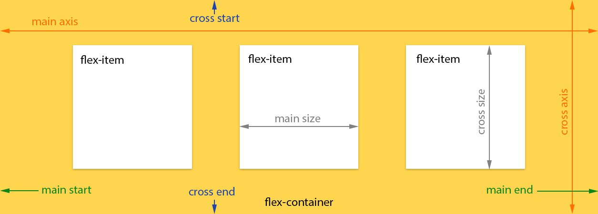
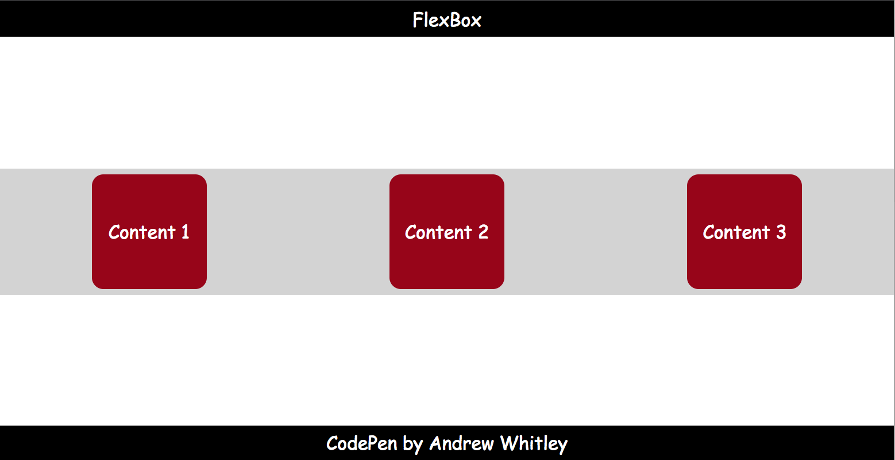

[](https://generalassemb.ly/education/web-development-immersive)

# Flexbox

With the basics of HTML & CSS down, let's explore more advanced aspects of CSS.
For a long time, arranging elements on a webpage was difficult, involving lots of hacks like using `table` or `float`.
Thankfully, those days are behind us and we have [Flexbox](https://developer.mozilla.org/en-US/docs/Learn/CSS/CSS_layout/Flexbox) which makes this easy!

## Objectives

By the end of this lesson, developers should be able to:

- Explain what Flexbox is and how to use it


## Introduction

HTML was originally document-oriented. 
CSS emerged as a way to style documents separately from the semantics of HTML.
While successful, CSS remains one of the most frustrating parts of web development:


Aligning items with CSS has traditionally been one of the key contributors to this aggravation. 
For a long time, there wasn't a good way to organize elements using CSS despite alignment being an increasingly important part of web design.

Today we'll be learning about one of two modern tools for aligning content on the web.


## Problem 1: Vertical Alignment

Let's start out with a problem that any web developer has dealt with:

**I have a `div`. I would like to center it vertically and horizontally on my
page.** The end result should look something like this:


Example on [Codepen](http://codepen.io/awhitley1233/pen/ygJzJW)

### You Do: Center a `div`

Take about **10 minutes** to try to get the div in this example centered like
the image above. Make sure it's still centered vertically and horizontally when
you change the screen size.

### You Tell Me: What Should I Try

```html
<html>
  <body>
    <div>Div 1</div>
  </body>
</html>
```

```css
body {
  min-height: 100vh;
  margin: 0 auto;
}

div {
  width: 100px;
  height: 100px;
  background: #990012;
  color: #ffffff;
  border-radius: 10px;
  font: 14pt Comic Sans MS;
  text-align: center;
  line-height: 100px;
}
```

<details>

<summary><strong>These might work:</strong></summary>

> **Padding**: The simplest approach would be to set equal padding on the top
> and bottom of the container (body) element. We would need to know the exact
> height of the element and container in order to get this exactly right. This
> can also get tedious when there is more than one element in a container.

> **Margin**: Similarly, we could add some margin to the element we are trying
> to center. The same issues remain.

> **Absolute Positioning**: You could use properties like `top` and `left` to
> position an element in the center. This, however, removes it from the document
> flow.

</details>

<details>

<summary><strong>These could work in other scenarios:</strong></summary>

> **`line-height`**: When vertically centering a single line of text, you can
> set the line-height to that of the whole container.

> **`vertical-align`**: Used to align words within a line of text (e.g.,
> superscript, subscript).

</details>

The tough part is that how to vertically center a element depends on its context
meaning that an element has to look to its parent and then align itself;
siblings start to make this very difficult (go figure!). Depending on your
situation, one or more of the above techniques could work.
[Here's an enlightening post on the matter](https://css-tricks.com/centering-in-the-unknown/).

### I Do: Flexbox to the Rescue

Laying out elements used to be difficult and fraught with error. Now, we can
just use Flexbox:

```css
body {
  min-height: 100vh;
  margin: 0 auto;
  display: flex;
  justify-content: center;
  align-items: center;
}
```

View solution [here](http://codepen.io/awhitley1233/pen/EZyvMY)

## How It Works



When you declare `display: flex;` in a CSS rule, whatever element is targeted by
that rule becomes a **flex container**.

That means that all of the flex container's **immediate** children can have flex
properties applied to them.

The flexbox approach differs from the methods described in the CodePen above in
that the arrangement of elements is managed by the **parent** container. The
child of a **flex container** is called a **flex item**. We can change the way
flex items display by setting item-specific properties that will come later in
the lesson.

After the `display` property, the most important flexbox property to understand
is `flex-direction`. It is very important to remember that the `flex-direction`
orients **flex container's main-axis**. The main axis can be set to run
vertically or horizontally depending on the value of `flex-direction`. All other
flex-related properties are defined in terms of the main axis.

First, use `flex-direction` to indicate whether you want the flex items in the
container to "read" left-to-right (`row`), right-to-left (`row-reverse`),
top-to-bottom (`column`), or bottom-to-top (`column-reverse`).

| flex-direction | main-axis Direction |
| -------------- | ------------------- |
| row (default)  | left-to-right       |
| column         | top-to-bottom       |
| row-reverse    | right-to-left       |
| column-reverse | bottom-to-top       |

The `justify-content` property aligns content relative to the **main axis**.
Possible values are: `flex-start` (default), `flex-end`, `center`,
`space-between`, and `space-around`.

> What do you think each does; does the flex-direction affect this?

The `align-items` property is similar to `justify-content` but aligns relative
to the **cross-axis**. There are similar options here: `flex-start`, `flex-end`,
`center`, `stretch` (default), and `baseline` (items are aligned by their
baselines / where the text is).

By default, a **flex container** will arrange its children in a single row or
column. The `flex-wrap` property can modify this with the values `nowrap`
(default), `wrap`, and `wrap-reverse`.

When text is wrapping, `align-content` controls how the rows or columns are
arranged relative to the cross-axis: `flex-start`, `flex-end`, `stretch`
(default), `center`, `space-between`, and `space-around`.

### In Summary

| Property                                                                                | What's It Do?                           | Examples                  |
| --------------------------------------------------------------------------------------- | --------------------------------------- | ------------------------- |
| **display**                                                                             |                                         | `flex`                    |
| **[flex-direction](https://developer.mozilla.org/en-US/docs/Web/CSS/flex-direction)**   | Sets the directional flow of flex items | `row`, `column`           |
| **[justify-content](https://developer.mozilla.org/en-US/docs/Web/CSS/justify-content)** | Align along main axis                   | `center`, `space-between` |
| **[align-items](https://developer.mozilla.org/en-US/docs/Web/CSS/align-items)**         | Align along cross-axis                  | `flex-start`, `center`    |

> That's a lot of CSS properties! Don't worry, you're not expected to memorize
> all of them. Being a developer is less about knowing everything off the top of
> your head and more about knowing best practices and where to find more info
> [Here's a great resource](https://css-tricks.com/snippets/css/a-guide-to-flexbox/).

### You Do: Explore Flexbox Properties

[Open this Codepen](https://codepen.io/ZakkMann/pen/OZBpob) to explore the
different Flexbox properties and see how they work.

## Problem 2: Make the Footer Stick

I want my footer to lie along the bottom of my page. Once I've accomplished
that, I want to evenly distribute the content boxes horizontally inside of the
`<main>` element.



[Example on CodePen](http://codepen.io/awhitley1233/pen/ygJzqy)

### You Tell Me: What Should I Try (Again)

```html
<html>
  <header>FlexBox</header>
  <main>
    <section>Content 1</section>
    <section>Content 2</section>
    <section>Content 3</section>
  </main>
  <footer>CodePen by Andrew Whitley</footer>
</html>
```

```css
body {
  min-height: 100vh;
  margin: 0 auto;
  font: 12pt Comic Sans MS;
}

header,
footer {
  width: 100%;
  height: 30px;
  background: #000000;
  color: #ffffff;
  text-align: center;
  line-height: 30px;
}

main {
  background: #d3d3d3;
}

section {
  width: 100px;
  background: #990012;
  color: #ffffff;
  border-radius: 10px;
  margin: 5px;
  text-align: center;
  line-height: 100px;
}
```

Making the footer lie against the bottom of the screen is pretty easy: just use
absolute or fixed positioning. However, using absolute or fixed positioning
means everything else on the page ignores my footer. The text of `<main>` could
easily run under the footer. We want the text to "push" the footer to the end of
the page.

### I Do: Flexbox to the Rescue Again

```css
body {
  min-height: 100vh;
  margin: 0 auto;
  font: 12pt Comic Sans MS;
  display: flex;
  flex-direction: column;
  justify-content: space-between;
}
```

<details>

<summary><strong>How is main axis of the `body` oriented here? What about the cross-axis?</strong></summary>

> Main: vertically, Cross: horizontally

</details>

Now let's horizontally distribute the `<section>` elements containing the page's
content inside of the `<main>`. What element should we style?

```css
main {
  background: #d3d3d3;
  display: flex;
  justify-content: space-around;
}
```

Now we have two **flex containers**: `main` and `body`. By setting
`display: flex` on main we can tell the three `section` elements to be
controlled as flex items.

[Solution on CodePen](http://codepen.io/awhitley1233/pen/PWzOPg)

<!--
## You Do: More Flexbox Properties (25 minutes / 1:05)

> 15 min research, 10 min presentations

Time for you to research some more Flexbox properties. You will be split into
groups and assigned one of the following flex properties:

- `flex-wrap`
- `flex-grow`
- `order`
- `align-content`

Your task is to:

- Come up with [ELI5 ("Explain Like I'm 5")](https://dev.to/t/explainlikeimfive)
  definition for the property (and maybe write one!).
- Create [a Codepen](http://codepen.io) demonstrating the property's usage, then
  post it in the `#sei29-discussion` Slack channel.
- If possible, practice using some of the flex properties we covered in the
  previous section.

> You will need to [create a free Codepen
> account](https://codepen.io/accounts/signup) in order to save your pen and
> share the link.

If you finish early, try exploring some of the [other flexbox
properties](https://css-tricks.com/snippets/css/a-guide-to-flexbox/) not
assigned in this exercise.


### Some Helpful Resources

- [CSS Tricks' Guide to
  Flexbox](https://css-tricks.com/snippets/css/a-guide-to-flexbox/)
- [A Visual Guide to CSS Flexbox
  Properties](https://scotch.io/tutorials/a-visual-guide-to-css3-flexbox-properties)
- [Solved by Flexbox](http://philipwalton.github.io/solved-by-flexbox/)
- [Flexplorer](http://bennettfeely.com/flexplorer/)

### Recap

<details>

<summary><strong><code>align-content</code></strong></summary>

> How multiple rows or columns are spaced along the cross-axis. Takes the same
>properties as justify-content.
>
>[Example](https://codepen.io/perryf/pen/RQNYPM)

</details>

<details>

<summary><strong><code>flex-grow</code></strong></summary>

> If the flex container is too big for all the flex items, flex-grow specifies
>the relative proportion a particular flex item will occupy
>
>[Example](https://codepen.io/perryf/pen/aqzaRV)

</details>

<details>

<summary><strong><code>flex-wrap</code></strong></summary>

> Defines flex item behavior if they expand beyond a single line.
>
>[Example](https://codepen.io/perryf/pen/vdEzMv)

</details>

<details>

<summary><strong><code>order</code></strong></summary>

> Specifies the order in which you want flex items to appear along the main
> axis. The default is 0. Negative numbers are allowed.

</details>

<details>

<summary><strong><code>flex-basis</code></strong></summary>

> Specifies how big the flex items "want" to be, or the initial size of a flex
>item
>
>[Example](http://gedd.ski/post/the-difference-between-width-and-flex-basis/)

</details>
-->

## The Holy Grail Layout (5 min / 1:20)


This is something you know well, even if you don't recognize the term. It
describes a webpage with a header, footer, and three columns: a wide "main"
column, a navigation column on the left, and an advertisement, site map, or
extra info column along the right.

Obviously, this layout won't work on tiny screens, unless you really like
super-skinny columns. It's common to stack things on top of each other for
mobile views to make one single column.

Before flexbox, this involved a lot of pushing and shoving with dimensions and
positioning. You would essentially have to write two completely separate
stylesheets (one for mobile, and one for desktop), each to control the different
layours.

With flexbox, just change the `flex-direction` for smaller screen sizes, make
any size / order adjustments on the sections of the page, and you're pretty much
done!

```css
@media screen and (max-width: 600px) {
  main {
    flex-direction: column;
  }

  section {
    order: 1;
  }
}
```

> A layout so holy,
> [it has its own Wikipedia article](<https://en.wikipedia.org/wiki/Holy_Grail_(web_design)>).

[Example](http://codepen.io/awhitley1233/pen/XpKzqV)

## Additional Practice

- [Flexbox Froggy](http://flexboxfroggy.com/) (10 min / 3:55)

## Resources

- [flexbox.io](https://flexbox.io/)
- [The Ultimate Flexbox Cheatsheet](http://www.sketchingwithcss.com/samplechapter/cheatsheet.html)
- [CSS Tricks Guide to Flexbox](https://css-tricks.com/snippets/css/a-guide-to-flexbox/)
- [A Visual Guide to CSS3 Flexbox Properties](https://scotch.io/tutorials/a-visual-guide-to-css3-flexbox-properties)
- [Solved by Flexbox](http://philipwalton.github.io/solved-by-flexbox/)
- [Flexplorer](http://bennettfeely.com/flexplorer/)
- [Holy Grail Layout - Solved By Flexbox](https://philipwalton.github.io/solved-by-flexbox/demos/holy-grail/)

## [License](LICENSE)

1. All content is licensed under a CC­BY­NC­SA 4.0 license.
1. All software code is licensed under GNU GPLv3. For commercial use or
   alternative licensing, please contact legal@ga.co.
